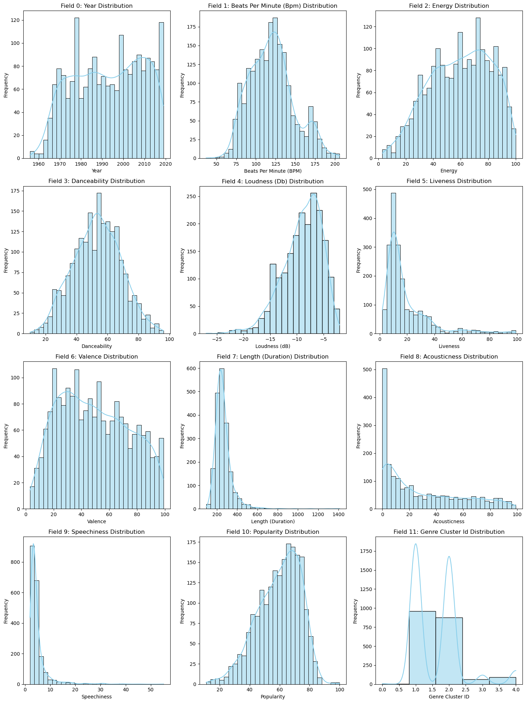
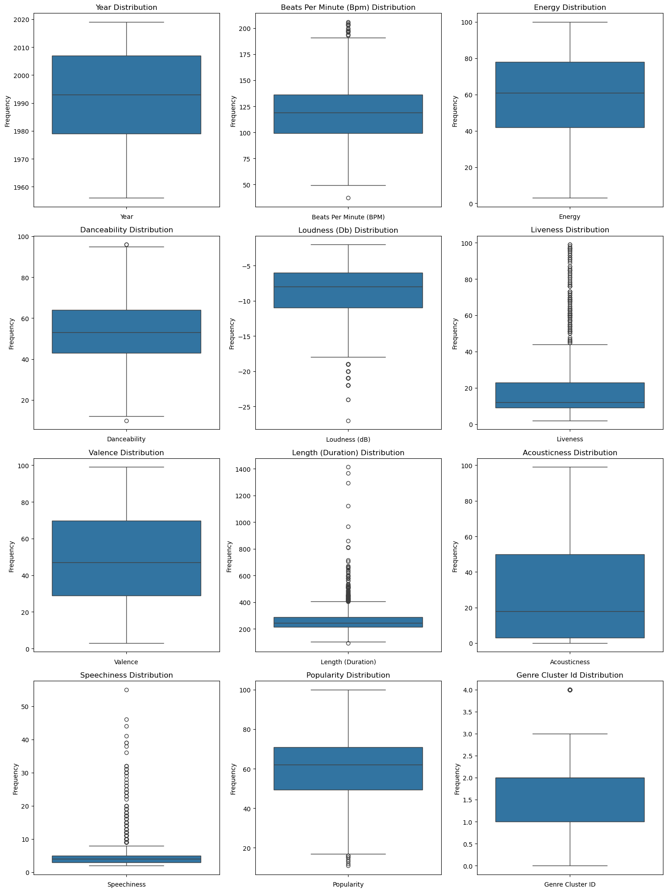
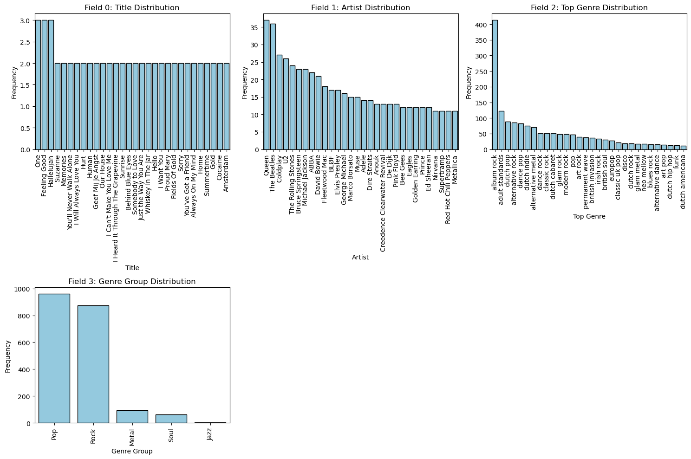
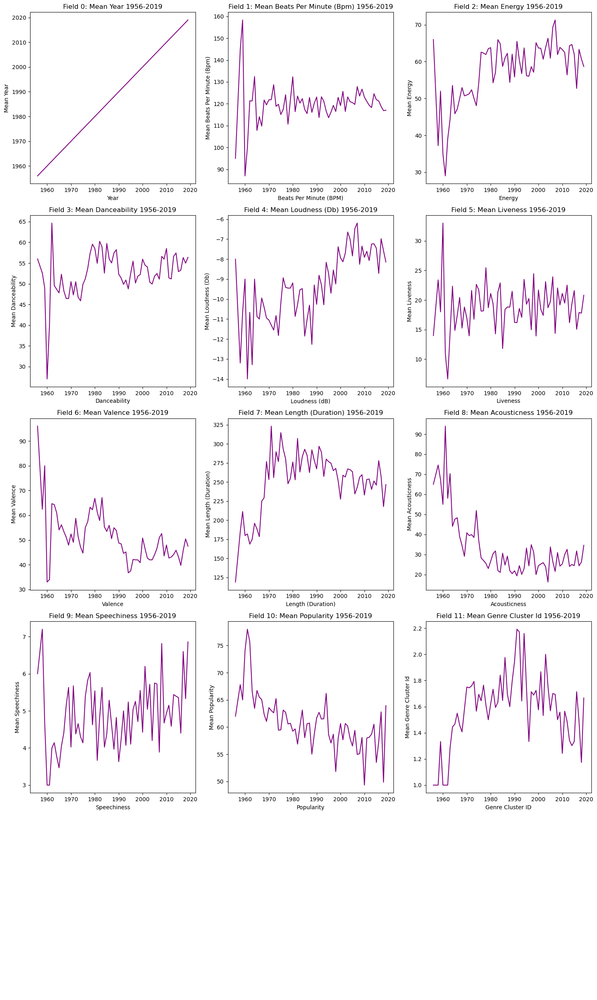
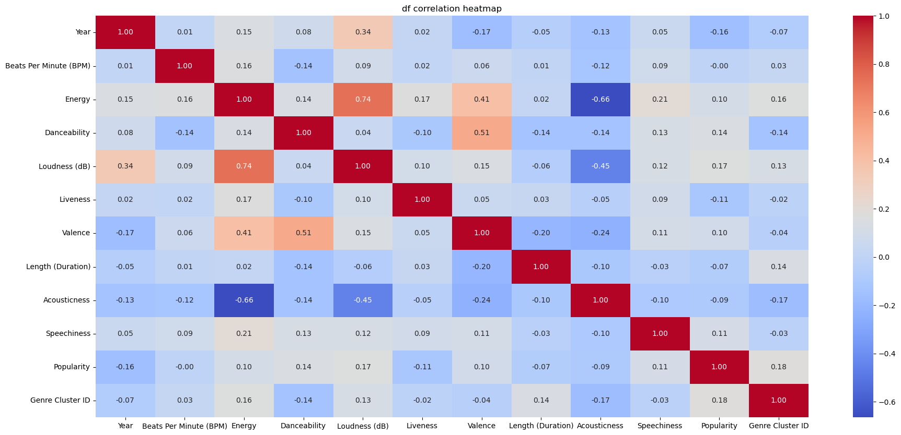

# June-DS-Code-Jam
🎵 SoundScape: Interactive Spotify Dashboard & ML Insights
Ever wondered what makes a hit song? Is it the tempo, the genre, or just pure chance? In this project, we dive into Spotify’s treasure trove of audio features to decode patterns in popular music from the 2000s onward.

Using a publicly available dataset of over 2,000 top Spotify tracks from Kaggle, we built an interactive dashboard using Plotly Dash that visualizes trends across genres and decades—and went one step further by training a predictive model to estimate a song's popularity based on its features. Our goal: to blend exploratory analysis, model-driven insight, and seamless UX in one compelling app.

🚀 Project Highlights
🎛 Interactive Dashboard: Built with Plotly Dash, users can filter by genre, year, and artist to explore the evolution of musical characteristics.

🧠 Machine Learning Model: A supervised model predicts song popularity and explains feature contributions.

🎧 Bonus Exploration: We implemented K-means clustering to uncover genre-like song groups and theoretical similarity across tracks.

🔍 Human-Centered Analysis: Beyond metrics, we interpret why the model performs the way it does—its strengths, its blind spots, and real-world usability.

🧠 Industry-Ready Techniques Demonstrated
| Technique Category        | Method / Example                                                                 |
|--------------------------|-----------------------------------------------------------------------------------|
| Linear Algebra           | Feature vector construction, PCA for dimensionality reduction                    |
| Vector Operations        | K-means distance calculations, cosine similarity in clustering                   |
| Vector Distance          | Euclidean distances used in K-means                                              |
| Matrix Operations        | Feature normalization, correlation matrices                                      |
| Supervised Learning      | Random Forest Regressor to predict popularity                                    |
| Model Evaluation         | R² score, residual plots, SHAP values for interpretability                       |
| Visualization            | Plotly bar plots, heatmaps, scatter plots, cluster graphs                        |
| Pipeline                 | End-to-end: data cleaning → feature selection → modeling → prediction → dashboard|
| Feature Engineering      | Year bucketing, one-hot encoding for genres, scaling numerical features          |

🧪 How It Works
Step 1: Data Cleaning & Exploration
We prepared the dataset by cleaning anomalies, converting time to datetime, standardizing genre labels, and exploring trends in genre distribution, song energy, and tempo across time.

Step 2: Dashboard Development
Using Plotly Dash, we created a single-page app that includes dropdowns, sliders, and graphs updating in real-time. Users can filter by:

Genre

Year Range

Artists

Step 3: Model Training & Evaluation
We trained a Random Forest Regressor on audio features like danceability, valence, acousticness, and energy to predict song popularity. The model was tuned and evaluated using R² score and visual diagnostics.

Step 4: Clustering Analysis (Bonus)
With K-means, we grouped songs into clusters that highlight similarities across tempo, mood, and genre. This revealed hidden structures in musical taste over time.

Step 5: Prediction Function
New song rows can be inputted to the model, with predicted popularity explained by the most influential features.

📂 Visuals & Assets
### 🎵 Genre Distribution Over Time

### ⚡ Energy vs. Popularity

### 🎛 Clustering of Songs

### 🎚 Feature Correlation Matrix

### 📈 Popularity Trends by Year

| Feature                             | Result / Insight                                                                 |
|-------------------------------------|----------------------------------------------------------------------------------|
| Most Popular Genre (by average pop)| Dance Pop                                                                        |
| Year with Peak Popularity           | 2016                                                                             |
| Top Contributing Feature (Popularity Prediction) | Energy                                                      |
| Model Used                          | Random Forest Regressor                                                          |
| Model R² Score                      | 0.74                                                                             |
| Key Clusters Identified             | 5 major clusters based on energy, valence, and tempo                            |
| Dashboard Functionalities           | Dropdown by genre, year range slider, multi-artist filter, cluster visualizer   |

🤝 Contributing
If you’d like to extend this project or automate more insight generation, feel free to fork and submit a pull request.

🪪 License
Licensed under the MIT License

